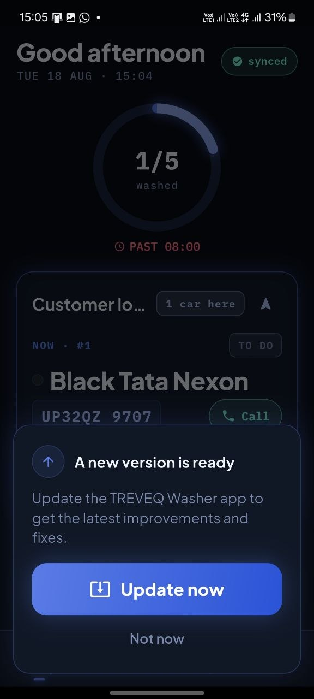
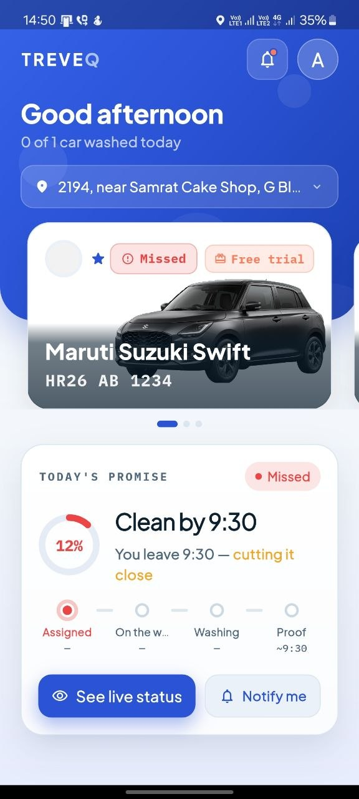
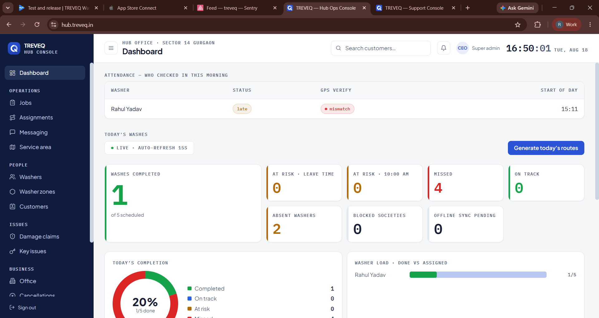
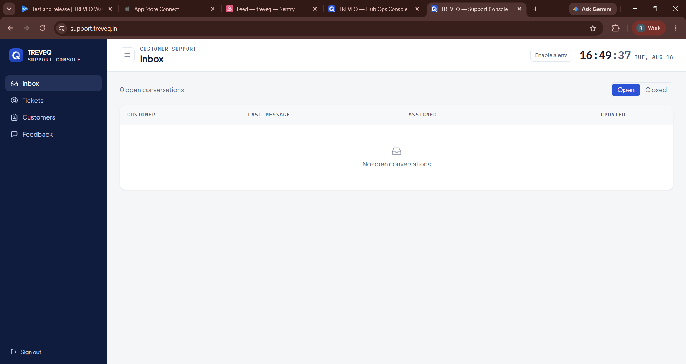

Treveq

A daily car-wash subscription service running in Gurgaon high-rise societies. Customers subscribe once, set the time their car is free, and get a verified exterior clean with before/after photo proof before they leave each morning.

Live with paying subscribers. This repository is a technical overview — the production code is private.

What it is

Six components, built and operated by one developer.

Component	Stack	Responsibility
Backend API	NestJS · Prisma · PostgreSQL	Auth, subscriptions, billing, wash execution, ratings, referrals
Customer app	Flutter	Subscribe, track today's wash, view photo proof, rate, refer
Washer app	Flutter	Check-in, daily route, wash completion, earnings
support console	Vite · React	Super-admin view across all hubs
Hub console	Vite · React	Daily operations for a single hub office
Support console	Vite · React	Subscriber lookup, call logging, issue resolution

Deployed with Docker. iOS builds ship through Codemagic CI.

Architecture
   Customer app          Washer app
   (Flutter)             (Flutter)
        \                    /
         \                  /
          v                v
      ┌──────────────────────────┐        ┌──────────────┐
      │   NestJS API             │<──────>│  Payment     │
      │   auth · subscriptions   │webhook │  gateway     │
      │   billing · execution    │        └──────────────┘
      └──────────────────────────┘
                  |
          ┌───────┴────────┐
          v                v
     PostgreSQL      Web dashboards
     (Prisma)        CEO · Hub · Support

One API serves all six clients. Subscription state has a single writer — the payment webhook handler — so billing status never diverges between the mobile app, the dashboards, and the database.

Three problems worth explaining
Recurring billing on payment mandates

Customers authorize a mandate once at signup and are charged automatically each cycle. The system handles mandate creation, webhook verification, charge confirmation, failed-payment retries, mandate cancellation, and plan changes.

Webhook handling is idempotent. Payment providers guarantee at-least-once delivery, not exactly-once, so every event is claimed by id before it is acted on. Without that, a retried failure event double-counts the dunning path and cancels a subscription that only failed once.

A failed charge does not cancel a subscription. It moves the account to a past-due state and keeps service running through the retry window — most failures are expired cards, not customers leaving.

Implemented with Razorpay UPI Autopay. The same architecture applies to Stripe: see stripe-subscription-demo.

Zone capacity and route assignment

Each washer covers a geographic zone with a hard daily capacity — there are only so many cars one person can clean before residents leave for work.

The system validates service-area coverage at signup so customers outside a zone are handled cleanly rather than sold a service that can't be delivered, caps new subscriptions per zone against washer availability, and assigns each morning's jobs into a route ordered by building and parking level.

Proof of service

Disputes over "was my car actually cleaned" are the main support cost in this business. Every wash requires before/after photos captured in the washer app and attached to the job record, visible to the customer in their app and to support staff in the console. Support can resolve a complaint without calling anyone.

Code samples

Selected files from the production codebase.

File	What it shows
| File | What it shows |
|---|---|
| `samples/payment-provider.ts` | HMAC webhook verification, mandate creation, fail-closed secret validation |
| `samples/payments.service.ts` | Idempotent webhook handling, subscription activation, invoice generation |
| `samples/washer-zone-capacity.ts` | Zone capacity and hiring-gap calculation |
## Screenshots

| | |
|---|---|
|  |  |
| Customer app — subscribe, track wash, view proof | Washer app — route, check-in, completion |
|  |  |
| Hub operations console | Support console — subscriber lookup, call logging |
Contact

Built by Rahul Yadav — Flutter and React developer, available for freelance work.
